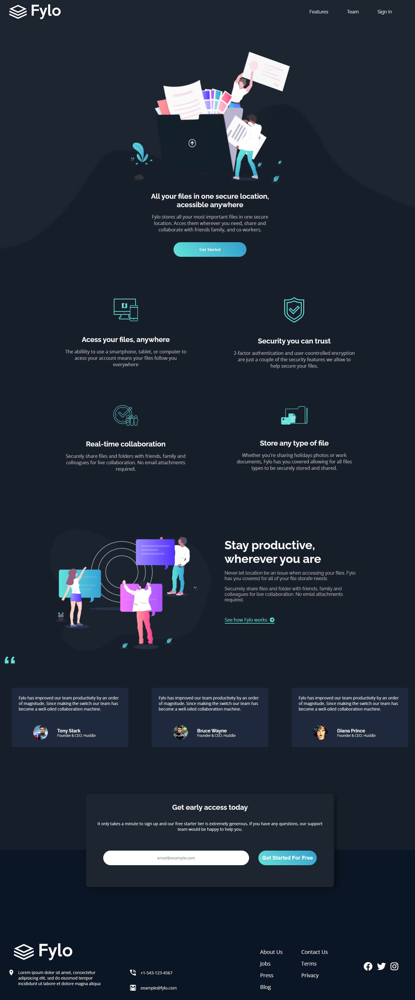

# Frontend Mentor - Fylo dark theme landing page solution

This is a solution to the [Fylo dark theme landing page challenge on Frontend Mentor](https://www.frontendmentor.io/challenges/fylo-dark-theme-landing-page-5ca5f2d21e82137ec91a50fd). Frontend Mentor challenges help you improve your coding skills by building realistic projects. 

## Table of contents

- [Overview](#overview)
  - [The challenge](#the-challenge)
  - [Screenshot](#screenshot)
- [My process](#my-process)
  - [Built with](#built-with)
  - [What I learned](#what-i-learned)
  - [Continued development](#continued-development)
- [Author](#author)

## Overview

### The challenge

Users should be able to:

- View the optimal layout for the site depending on their device's screen size
- See hover states for all interactive elements on the page

### Screenshot

## My process

### Built with

- Semantic HTML5 markup
- React js
- Components
- CSS custom properties
- Flexbox
- CSS Grid
- Mobile-first workflow
- [React](https://reactjs.org/) - JS library

### What I learned

I learned a lot of things making this application, one of this things it's how to use components in React, I learn somethings else
about Css with help of some friends, like variables and responsive layout, I had a lot of trouble with that responsiveness part, but now I
understanding somethings what gonna help me in my next projects.

### Continued development

Still need to adjust some things related to responsiveness (tablets).

## Author

- Frontend Mentor - [@LucasAlt40](https://www.frontendmentor.io/profile/LucasAlt40)

